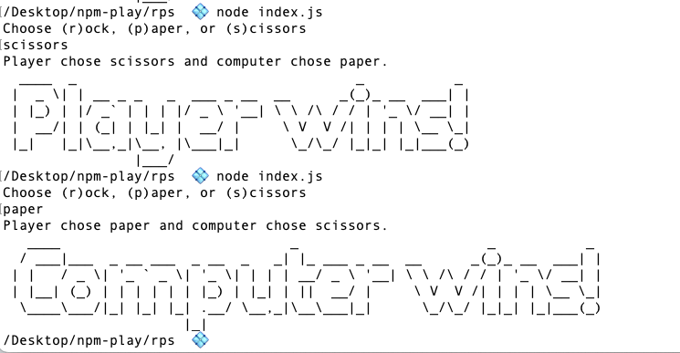

## Rock Paper Scissors

Build a rock, [paper and scissors game](https://en.wikipedia.org/wiki/Rock_paper_scissors) with Node.js, `readline` and the npm package [`figlet`](https://www.npmjs.com/package/figlet).

- When the game starts, it should ask the player to choose `rock`, `paper` or `scissors`.
- The computer should choose a random option of `rock`, `paper`, or `scissors`.
- Write some logic to figure out the winner or if there is a tie.
- Log the player and computer choice. For example, after the user selection has been made, log the following:

> "Player chose rock and computer chose paper."

Then, using the `figlet` package, print one of the following messages:

- "Player wins!"
- "Computer wins!"
- "It's a tie!"

